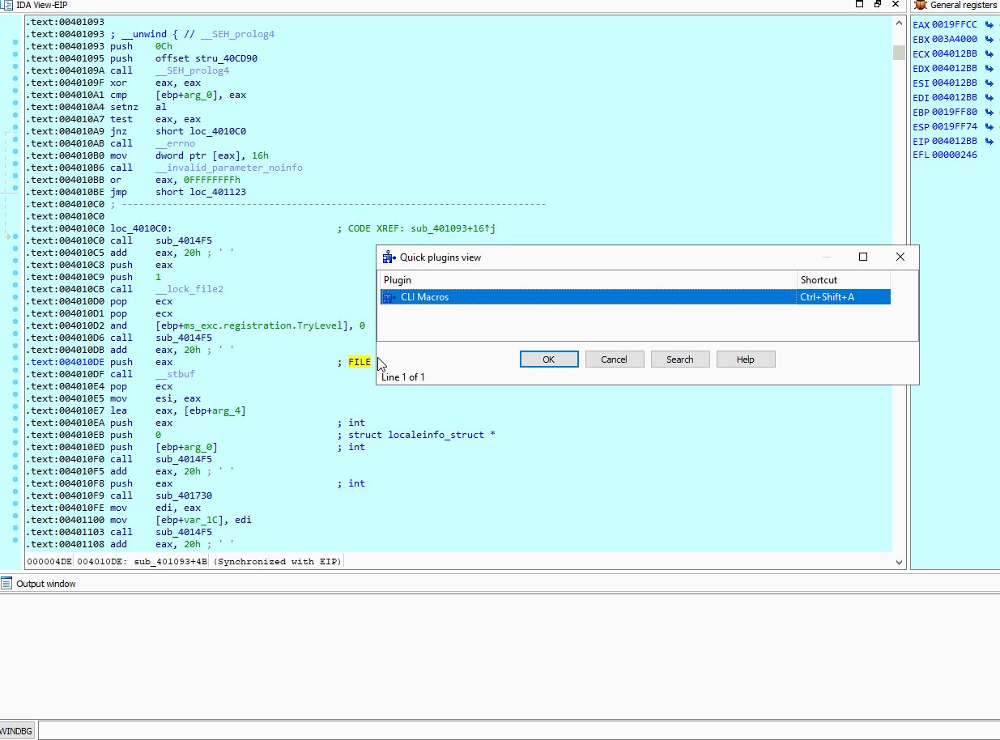
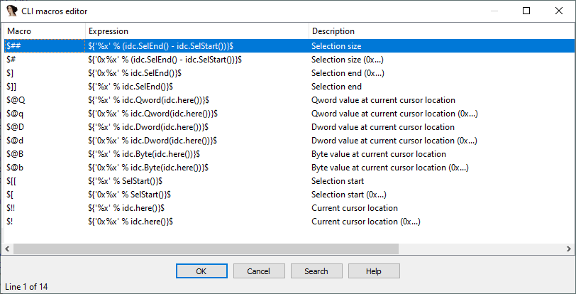
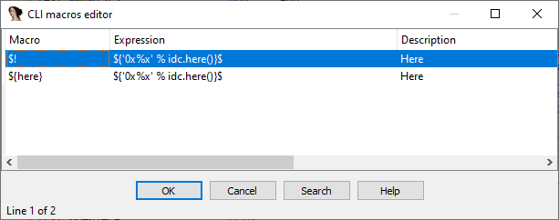
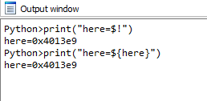

# What is *climacros*?

CLI macros is a productivity tool that lets you define and use static or dynamic macros in IDA's command line interfaces (Python, IDC, WinDbg, BochDbg, Gdb, etc.).



# Usage

When installed, *climacros* is always active. It comes with predetermined set of macros:



To create or edit new macros, simply invoke the macro editor from the "Quick plugins view" window (Ctrl-3).

## Static macros

Static macros get substituted as-is in the CLI. For example the following macro:


Outputs the following when executed:


## Dynamic macros

It is possible to define dynamic macros that get expanded as a result of evaluating a Python expression that returns a string.
For example, the `idc.here()` command is very useful and can be abbreviated with a shorter macro, say `$!` or `${here}`.

To define a dynamic macro, just surround the its expression with `${` and `}$`.

The long form macro `${here}` for the `idc.here()` expression is defined like this:


The short form `$!`:



A macro is invoked when it is present in a CLI command:



## Inline substitution

You don't have to define macros in order to get expressions expansion in the CLI. If you need a one-off expression expansion in the CLI, just define the expression inline:

```python
fn = "test_${str(sum(range(10)))}$.bin"
```
Or:
```python
v = "${str(1 + 2 + 3 + 4)}$"
```

The expression should always evaluate to a **string**, therefore always remember to `str()` the expression or to format it `"%x" % expr` if it does not return a string.

# Installation

*climacros* is written in C++ with IDA's SDK and therefore it should be deployed like a regular plugin. Copy the plugin binaries to either of those locations:
* `<IDA_install_folder>/plugins`
* `%APPDATA%\Hex-Rays/plugins`

Since the plugin uses IDA's SDK and no other OS specific functions, the plugin should be compilable for macOS and Linux just fine. I only provide MS Windows binaries. Please check the [releases page](https://github.com/0xeb/ida-climacros/releases).

The first time you run the plugin, it will be populate with the default macros. If you delete all the macros, you won't get back the default macros unless you delete the following file: `%APPDATA%\Hex-Rays/firstrun.climacros`.